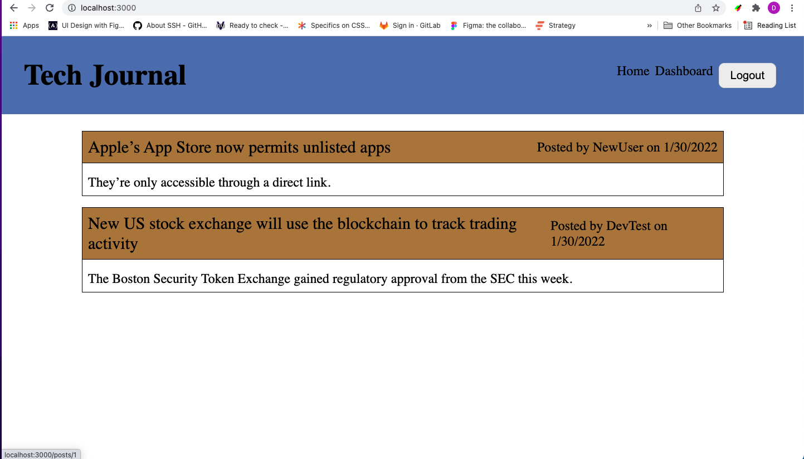

# Tech-Journal

## What is it?

CMS-style blog where developers can publish their blog posts and comment on other developers’ posts as well

## Screenshot and link to live URL

Click [here](https://intense-beach-71973.herokuapp.com/) to go to the live version hosted on heroku

## How to use it

1. Make sure you have mySql and node.js installed
2. Open up your Command Line Interface in the root of the application directory
3. Type `npm install` to install all dependencies
4. Type `npm run start` to start the server
5. Go to your browser and type `http://localhost:3000/` into your browser to access the site
6. Click the signup link to create an account. (_The email doesn't have the be real but it needs to follow the standard email format of `someText@someText.com`_
   )
7. You should be directed to your dashboard next, you can create new posts here (_Your title must be at least 1 character and your post must be between 4 - 255 characters long_)
8. If you click on the post you can view all of the comments that have been made to it and you can either edit it or delete it and you also have the option to leave a comment on it
9. If you click on the homepage link you will be directed to the homepage where all posts from all users will be available
10. If you click on one of the posts you will be directed to a new page where you can leave a comment on that post
11. If you are not logged in you can simply view the comments from the homepage

## Technologies

HTML, CSS, Javascript, Node.js, Express-Handlebars, MySql, Sequelize

## Liscence

Not under any liscence

## Contributions

Made by Daniel Arzanipour

## Questions

[My Github](https://github.com/DanielArzani)

If you need to reach me for any additional questions, you can reach me at my [Gmail](mailto:daniel.arzanipour@gmail.com)
